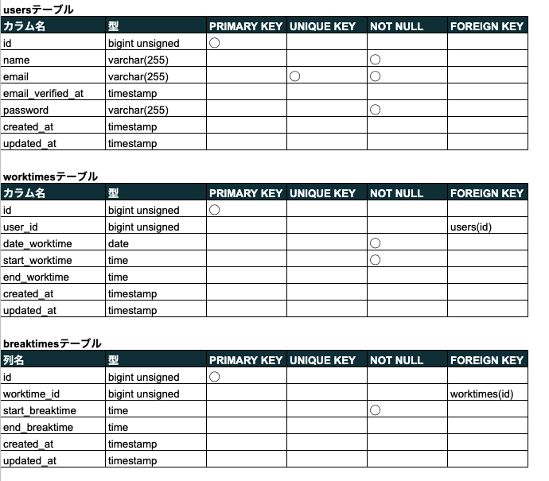

# Atte
ユーザーの勤務時間、休憩時間を記録・閲覧できるアプリケーションです


## 作成した目的
企業内の人事評価のため

## アプリケーションURL
http://localhost/

## 他のリポジトリ
特になし

## 機能一覧
- 会員登録
- ログイン
- 勤務開始・終了時刻の記録
- 休憩開始・終了時刻の記録
- 日付別の勤怠データ閲覧（全ユーザー分）
- ユーザー別の勤怠データ閲覧（全日分）
- 登録ユーザー一覧の確認

## 使用技術（実行環境）
- PHP 8.1.27
- Laravel 9.52.16
- MySQL 8.0.26

## テーブル設計


## ER図


## 環境構築

 1. ```docker-compose exec php bash```
 2. ```composer install```
 3. .env.exampleファイルから.envを作成し、環境変数を変更
 4. ```php artisan key:generate```
 5. ```php artisan migrate```
 6. ```php artisan db:seed```
 7. ```php artisan schedule:work```

## 補足事項
開発用の仮想SMTPサーバーとして、Mailtrapを使用しています
サービスの登録と.envファイルの編集が必要です

db:seedでは、確認用の仮データとして以下のデータが挿入されます。
- ユーザーアカウント：user01~user10の10名分のユーザー
- メールアドレス：user01@example.com~user01@example.com（上記ユーザー名に対応したメールアドレス）
- パスワード：coachtech
- 勤務データ：2024-01-01〜06まで15件のデータ